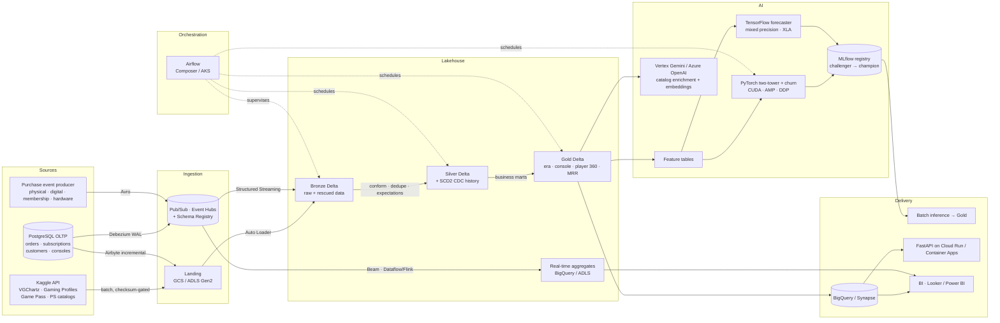

# Architecture

## 1. The two variables

Everything in this platform is a function of two variables:

```
CLOUD        ∈ {gcp, azure}
ENVIRONMENT  ∈ {dev, qa, prod}
```

They are read exactly once, in `src/gaming_lakehouse/config.py`. Storage URIs, brokers, the
warehouse engine, the LLM provider, secret backends, cluster sizes, data-quality severity and
Terraform module selection all derive from them. No other module reads `os.environ` for these
concerns. That is the whole trick: a "multi-cloud" system that is not two systems.

## 2. End-to-end flow



## 3. Layer contracts

| Layer | Written by | Guarantees | Retention |
|---|---|---|---|
| **Landing** | `ingestion/kaggle_client.py`, Airbyte | Immutable, checksum-marked, partitioned by `ingest_date` | 30 days |
| **Bronze** | Auto Loader, `streaming/bronze_stream.py` | Append-only, schema evolution with `_rescued_data`, CDF on | Full history |
| **Silver** | `transform/bronze_to_silver.py`, `cdc/cdc_merge_silver.py` | Conformed types, deduplicated, expectations enforced, SCD2 for CDC entities | Full history |
| **Gold** | `transform/silver_to_gold.py` | Business-ready, liquid-clustered, statistics computed | Rebuildable |

Every layer is Delta. Every table has Change Data Feed enabled, which is what makes the
Silver→Gold step incremental rather than a nightly full rescan.

## 4. Two streaming engines, on purpose

| | Spark Structured Streaming | Apache Beam |
|---|---|---|
| **Owns** | The lakehouse path (Bronze/Silver Delta, CDC MERGE) | The low-latency path (windowed aggregates → serving store) |
| **Latency** | 30s micro-batches | Sub-second, sliding windows with early triggers |
| **Why** | `foreachBatch` + Delta MERGE is the only way to express upserts; RocksDB state store handles large keyspaces | Dataflow/Flink autoscale on event rate, not on cluster size; exactly-once via the BigQuery Storage Write API |
| **Runner** | Databricks (both clouds) | Dataflow (GCP) / Flink on AKS (Azure) |

They share one contract: `streaming/event_schemas.py` and the Avro schema registered in the
broker. A producer that cannot serialize against it is rejected before it reaches either engine.

## 5. CDC: real-time *and* batch

**Real-time** — Debezium reads the Postgres WAL and publishes the *full envelope*
(`before`/`after`/`op`/`source`). Spark consumes it and applies an SCD2 MERGE. Deletes become
tombstones, never physical deletes; a deleted order is still a fact that happened.

**Batch** — Airbyte runs log-based incremental syncs every two hours as a backstop and covers
the long tail of SaaS connectors. If Debezium is down for an hour, Airbyte's next sync closes
the gap. Two independent paths to the same Silver tables, reconciled by the LSN.

Non-negotiable operational rule: **heartbeats**. A quiet table stalls the replication slot and
Postgres retains WAL until the disk fills. `dag_streaming_ops.py` checks slot health every
10 minutes and fails loudly.

## 6. Deployment topology

| Concern | Tool | Why |
|---|---|---|
| Cloud infrastructure (storage, brokers, warehouses, identities, budgets) | **Terraform** | Slow-changing, needs a plan/approve gate |
| Workloads (jobs, clusters, streams, wheel) | **Databricks Asset Bundles** | Fast-changing, deployed on every merge |
| Ingestion connectors | **Airbyte GitOps** (`apply_config.py`) | Declarative, applied by CI, nobody clicks in a UI |
| DAGs | **Composer bucket sync** (GCP) / **git-sync** (Azure) | Native to each platform |

A job deploy can never touch infrastructure. That separation is why `bundle deploy` can run
twenty times a day and `terraform apply` runs when someone means it.

## 7. Environments

| | dev | qa | prod |
|---|---|---|---|
| DQ severity | `warn` | `drop` | `fail` |
| Compute | spot, 1–4 workers | spot, 2–8 | on-demand, 4–32, Photon |
| Streams | paused | continuous | continuous |
| Model promotion | logged only | `@challenger`, shadow-scored 24h | `@champion` after the gate |
| Deploy trigger | push to `develop` | merge to `main` | manual approval on the GitHub Environment / Jenkins `input` |
